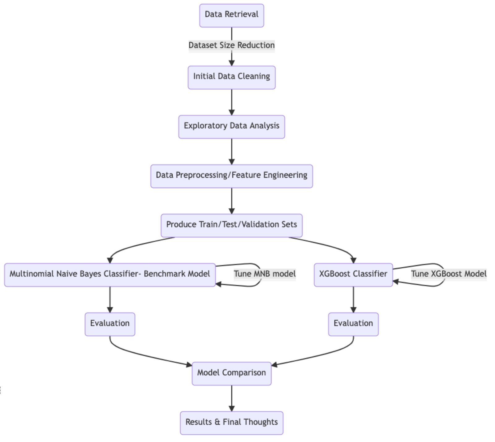
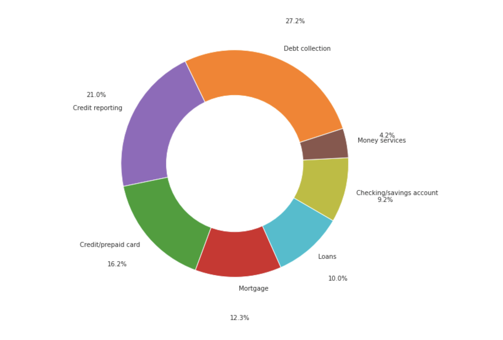

# Multi-class classification of Consumer Complaints on Financial Products: An Analysis with  Multinomial Naive Bayes and XGBoost
  

## Updates

### Version 1.0
- Latest version of the finished Jupyter Notebook for the first version of the project can be found here: <a href="https://nbviewer.org/github/gpsyrou/Categorization_Consumer_Complaints/blob/main/notebooks/Consumer_Complaints.ipynb" >V1.0 Notebook</a>

### Version 2.0 (WIP)
- _Work in progress_ - This version will move away from the AWS implementation to avoid excessive costs.

## Introduction 

Complaints from customers have always been a vital component of every successful company/organization. When the complaints are well-structured and provide insightful - rather than plain judgmental - feedback regarding the consumers experience with the product or service, they can assist the organizations to understand their customers needs - which in the long run could lead to satisfied customers and thus to higher earnings.

Hence, it’s of high importance for the organizations to have highly responsive complaint-resolution mechanism between themselves and the customer. For that purpose, there are common Natural Language Processing (NLP) techniques and algorithms that could assist the companies to build such mechanisms to effectively evaluate and respond to their customers complaints.

In this repo, we will build an automatic product categorization solution based on the customer’s views regarding these products, and use the customer’s complaints themselves to automatically assign them to one of the predefined categories.  

Predicting the correct category for a complaint can be very beneficial for the financial institutions that have to deal with responding to hundreds of complaints per day. If the customer who is filling the complaint does not submit it under the correct category, then that becomes a cost for the financial institution as -usually- they will afterwards have to:

- Identify that a complaint is under the wrong category in the first place, which is something that happens only after someone has already spent time with the case

- Re-classify and redirect the complaint to the correct category and the appropriate personnel for further examination

## Project Design

1. **Data Retrieval & Dataset Reduction**: Retrieve data from source and reduce dataset to the required size and the specific years of interest.
2. **Initial Data Cleaning**: Data cleaning tasks (e.g. removal of rows that don’t contain a complaint).
3. **Exploratory Data Analysis**: Use summary tables and visualizations to further understand the data.
4. **Data Preprocessing/Feature Engineering**: Tokenization of complaints, further cleaning (e.g. removal of punctuation), lemmatization, text vectorization with Bag of Words, and more.
5. **Train/Test/Validation sets creation**: Split data to subsets that will be used for training, tuning and performance evaluation and generalization .
6. **Implementation of MNB and XGBoost models**: Algorithm creation, training and tuning.
7. **Model Evaluation and Comparison**: Evaluate the results, compare models in terms of performance and draw conclusions regarding the usefulness of each algorithm. <br><br>


<p align="center">
  
</p>

## Data

The data used in this project contain complaints that have been made by consumers regarding financial services and products (e.g. student loans, credit reports, etc) in the US from 2011 to the current date. Each of the complaints is marked to belong under one Product category. This makes the data ideal for supervised learning purposes, with the text (complaint) as the input, and the category that the complaint belongs to as the target variable.<br>

The seven Product Categories that a complaint can belong to are:

• Checking/savings account<br>
• Credit reporting<br>
• Credit/prepaid card<br>
• Debt collection<br>
• Loans<br>
• Money services<br>
• Mortgage<br>


<p align="center">
  
</p>

Please note that the original dataset contains data from 2011 to 2021 and it is publicly available. Furthermore, it’s getting updated daily, something that makes it quite large. Hence, for the purposes of this project we will use a subset of this dataset and focus only at the aforementioned time period of two years (2019 and 2020).

### Environment Requirements
The project has been completed by utilizing **_Amazon SageMaker_** for the data wrangling, EDA, model tuning/training and evaluation, as well as
**_Amazon S3_** for data storage. The main language of the project is Python.

Python packages/libraries used:
```
sagemaker==2.59.3
boto3==1.18.45

wget==3.2
nltk==3.6.2
json==2.0.9
zipfile==3.6.13
pandas==1.1.5
numpy==1.17.0
pathlib==3.6.13
seaborn==0.11.2
matplotlib==3.6.13
warnings==3.6.13
sklearn==0.24.2
joblib==1.0.1
```
### Data Retrieval Process

This is a public dataset and can be found in the following location: https://catalog.data.gov/dataset/consumer-complaint-database.

Please note that the dataset is keep getting updated daily, and the latest version can be found here: https://files.consumerfinance.gov/ccdb/complaints.csv.zip.
(Note: If you click on this link it will automatically start to download the dataset)

Because of the constant updates on this dataset and it's increase in the size, we are going to use a _subset_ of the dataset. Specifically, we are going to use the complaints that have been made by consumers between January 2019 to December 2020. This will allow us to focus on specific years of interest, while keeping the observations in the dataset (and thus the size) to some logical ranges so that we can work with them on AWS.

**Step 0.**

Make sure you have installed the following Python packages:
```txt
wget==3.2
pandas==1.3.0
zipfile==3.7.6
```
**Step 1.**

To retrieve the <em>whole</em> dataset in your local directory, please run the following Python script:

```python
import os
import wget
import zipfile

data_out_path_dir = "/Users/georgiosspyrou/Desktop" # !Change this to the path where data will be saved in your local machine

data_web_location = "https://files.consumerfinance.gov/ccdb/complaints.csv.zip"
full_data_csv_name = 'complaints.csv'

print("Dataset will be saved in '{0}'".format(data_out_path_dir))

if not os.path.exists(data_out_path_dir):
    os.makedirs(data_out_path_dir)

if not os.path.isfile(os.path.join(data_out_path_dir, full_data_csv_name)):
    zip_filename = wget.download(url=data_web_location, out=data_out_path_dir)

    with zipfile.ZipFile(zip_filename, 'r') as zipf:
        print("\nExtracting files from {0} to {1}\n".format(zip_filename, data_out_path_dir))
        zipf.extractall(data_out_path_dir)
    
    print("Removing file {0} ...".format(zip_filename))
    os.remove(zip_filename) 

```

Please note that the output file from this will be around 1.5GB.

**Step 2.** 

If you further want to filter out the data to the specific complaints that were conducted between January 2019 and December 2020 (which will be the main dataset of this project), please run the script in Step 1 to retrieve the data, and then run the following Python script:

```python
import os
import pandas as pd

csv_file_path = os.path.join(data_out_path_dir, full_data_csv_name)
complaints_df = pd.read_csv(csv_file_path)

complaints_df['Date received'] = pd.to_datetime(complaints_df['Date received'])

# Get the year that the complaint took place as a separate column
complaints_df['Year'] = complaints_df['Date received'].apply(lambda date: date.year)

# Define a function to help reduce the dataset by date
def subset_dataframe_on_date_column(
    df: pd.DataFrame,
    date_col: str,
    min_date: str,
    max_date: str
) -> pd.DataFrame:
    reduced_df = df[(df[date_col] >= min_date) & (df[date_col] <= max_date)]
    return reduced_df

complaints_df = subset_dataframe_on_date_column(
    df=complaints_df,
    date_col='Date received', 
    min_date='2019-01-01',
    max_date='2020-12-31'
    )

reduced_csv_filename = 'complaints_reduced.csv'
reduced_csv_filepath = os.path.join(data_out_path_dir, reduced_csv_filename)

# Save the reduced dataset locally
complaints_df.to_csv(reduced_csv_filepath, index=False)
```

Please note that the output file from this will be around 550MB.

## Algorithms

### Benchmark Model

**Multinomial Naive Bayes** is a simple but powerful algorithm under the umbrella of the ‘Naive Bayes’  models. Specifically, this is a family of models that are leveraging Bayes Theorem to perform their predictions, i.e. utilizing Bayes theorem to compute the probabilities of an instance belonging under a specific category - which in our case is the Product category.

The ‘naivety’ of the model occurs due to the fact the Multinomial Naive Bayes is making a big assumption during the development of the model. Precisely, we are assuming that the features in the dataset are independent from each other. In practice this is rarely the case as features tend to be correlated with each other. We can imagine the same principle especially applies to text data, where words - and especially the order that they appear inside a text - could affect the whole meaning of a sentence. 

Nonetheless the above is true, it has been proven that Multinomial Naive Bayes has had some great results both in the industry, as well as the academia, and it’s considered a great algorithm - especially when we are looking for a solution that performs well but needs low training times and computational power.

Therefore, we are going to build and evaluate such a model, which will act as a “simple” but powerful baseline for categorizing the complaints.

### Extreme Gradient Boosting (XGBoost)

**XGBoost** is the main classifier that we are going to use in this project, and it’s one of the most well-known and successful algorithms that is widely used both for classification and regression purposes, mainly due to it’s great performance. It’s a form of an ensemble algorithm - which means that its leveraging the creation of many weak learners before it makes any predictions. XGBoost is utilizing boosting - which is a form of sequential learning (i.e. weak learners that are constructed sequentially and not in parallel like in bagging methods) - to build a series of decision trees (most of the times) .

In this project we will construct an XGBoost classifier, tune it and evaluate it - while trying to answer the question: 

_Would a more sophisticated model, like XGBoost, vastly outperform a simple prediction model like Multinomial Naive Bayes ?_

## Evaluation Metrics
Given that we are interested in building a process where we can assign as many complaints to their correct category as possible, we are proposing the **F1-score** as the main evaluation metric. Specifically, we will try to optimize and compare the models on the ‘macro’ version of the F1 score, which does not take into consideration the specific weights (i.e. number of instances per class) and thus assigns equal importance to each class. That way we can optimize the algorithms to favour all classes and not the majority ones.

Specifically, the F1-score can be calculated by following the formula below:

$$Macro \: F_{1}-score=\frac{1}{|T|} \cdot \sum_{t{\in}T}\frac{2 \cdot \text{Precision} \cdot\text{Recall}}{\text{Precision} + \text{Recall}}$$

, where T is describing the number of classes/labels.

Except the quantitative evaluation metric above, we will also take into consideration the practical implications of constructing a machine learning algorithm in the business world. Hence, we should also take into account the complexity, as well as the time to train/tune each of the models.  These two factors can massively change the decisions that a company might make about which model to productionize, as more complex/time consuming models tend to be a higher cost for them.


